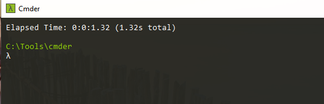

# Cmder Schnell. 
Loader very fast for Cmder. A little more than a second ;-)

This is a personalized config for the init.d file for Cmder. This file change the  loader for Cmder and reduce all not necesary for the start the program quickly.

Maybe It have errors but the slow loading was driving me crazy. Sorry for that and my english!

Release 1.0 Added Features for start on VisualStudio Code. Before this a can start the Cmder in less than a second :o

The name of the project  is in German, because  I am a fan of   German series Dark :). I think this means Quick in google translator.

**Pepe Medina**
